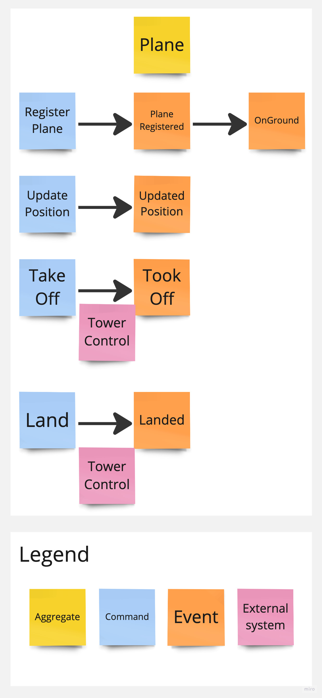

# Example domain design - event sourcing - using rust cqrs

Small example project to implement a `Plane` aggregate using [serverlesstechnology/cqrs](https://github.com/serverlesstechnology/cqrs).

This repository includes:

- a binary crate for the [axum server](https://github.com/tokio-rs/axum)
- a library crate for the plane's [domain](https://en.wikipedia.org/wiki/Domain-driven_design)

Developed thanks to:

- [serverlesstechnology/cqrs-demo](https://github.com/serverlesstechnology/cqrs-demo)
- [https://doc.rust-cqrs.org](https://doc.rust-cqrs.org/intro.html) (very good documentation)
- [axum 0.6 update](https://tokio.rs/blog/2022-11-25-announcing-axum-0-6-0)

## [Event storming](https://en.wikipedia.org/wiki/Event_storming)



## Getting started

### Prerequisites

- developed with `Rust 1.68`
- docker-compose

### Run

```bash
# terminal 1
docker-compose up -d
cargo run

# terminal 2
./test/test_api_plane.sh
```

#### Expected terminal 1 output

`crates/domain-plane/src/queries/logger.rs` logs every `Plane events`

Format:

> id: '{{Aggregate ID}}', sequence: {{Event number for the given aggregate}}
> 
> {{event as a JSON unless the event contains no data (e.g. "OnGround")}}

```
******************************************************
id: 'test-plane-27355', sequence: 1
{
  "Registered": {
    "registration_id": "test-plane-27355"
  }
}
******************************************************
id: 'test-plane-27355', sequence: 2
"OnGround"
******************************************************
id: 'test-plane-27355', sequence: 3
{
  "PositionedAt": {
    "latitude": 1.0,
    "longitude": 2.0,
    "altitude": 0
  }
}
******************************************************
id: 'test-plane-27355', sequence: 4
"TookOff"
******************************************************
id: 'test-plane-27355', sequence: 5
{
  "PositionedAt": {
    "latitude": 10.0,
    "longitude": 20.0,
    "altitude": 10
  }
}
******************************************************
id: 'test-plane-27355', sequence: 6
{
  "PositionedAt": {
    "latitude": 11.0,
    "longitude": 21.0,
    "altitude": 20
  }
}
******************************************************
id: 'test-plane-27355', sequence: 7
"Landed"
```


#### Expected terminal 2 output

The journey shows the plane's status and the current or last journey positions (history is cleared upon take off)

```
***************************
* Plane: test-plane-27355
***************************
Registering plane

Updating position

Prepare for take off!

Updating position

Journey
{"registration_id":"test-plane-27355","status":"InAir","positions":[{"latitude":10.0,"longitude":20.0,"altitude":10}]}

Updating position

Prepare for usual landing!

Journey
{"registration_id":"test-plane-27355","status":"OnGround","positions":[{"latitude":10.0,"longitude":20.0,"altitude":10},{"latitude":11.0,"longitude":21.0,"altitude":20}]}
```